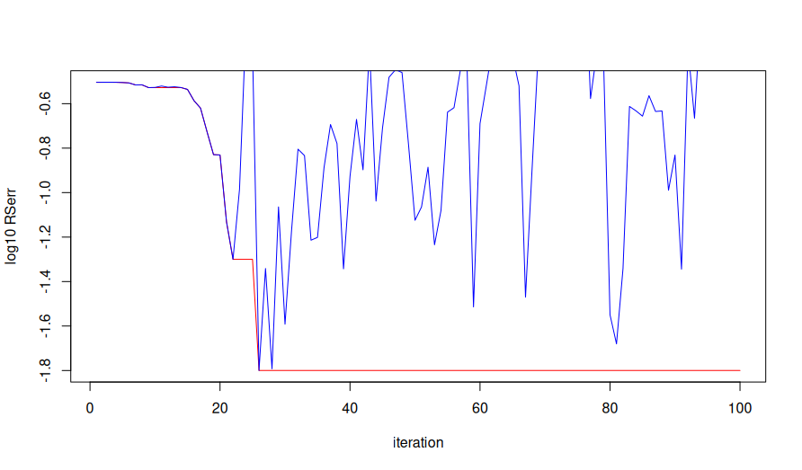
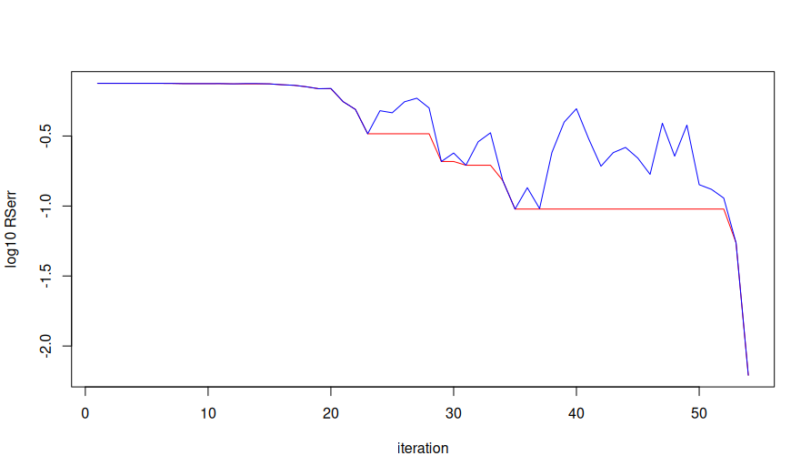

# coreqmapr
'coreqmapr' provides functions in R to adjust downcore predicted values of modelled lake sediment characteristics using known values at the top of the core. Implements techniques similar to Empirical Quantile Mapping (EQM) and Quantile Delta Mapping (QDM) to adjust downcore predictions probabilistically.

## Methodology
The package provides 4 methods to transform values, which build on each other successively. Values are transformed by estimating adjusted means + standard deviations, then back-transforming values to preserve an initial trend.

### Base naive transformation
The base naive transformation included in the package is similar to a simple additive delta method known in climate downscaling.
The mean is naively adjusted by adding the error at the top of the core.
$\hat{\mu} = \mu + \epsilon$

The standard deviation is then scaled by the same amount by multiplying the new mean with the original coefficient of variation.
$\hat{\sigma} = \hat{\mu} \times CV_{ORIG}$

### Base arithmetic transformation
The base naive transformation adjusts mean + S.D. values towards the known top-of-core value, but this does not often result in the top-of-core value actually aligning with the known value. To do this, a multiplicative delta scaling method can be used to find a combination of mean + S.D. so that the top-of-core value perfectly aligns with the known value.
$\hat{x} = \beta x$
where $x$ is either the mean or S.D.

There are theoretically infinitely many $\beta$ that can result in the intended value, so the combination of $\beta$ parameters that is closest to the original mean + S.D. (i.e., both $\beta$ close to 1) is chosen.

### Empirical Quantile Mapping
The EQM-like method in this package transforms values by adjusting the original core mean or S.D. up to their arithmetically transformed using some combination of the original parameter quantile and the quantile of the error value for the core.
$\hat{x} = F^{-1}_{ARITH}\left[\left(1-w\right)F_{ORIG}\left(x_{ORIG}\right) + wF_{\epsilon}\left(\epsilon\right)\right]$
where $x$ is either the original mean or S.D.

$F(.)$ refers to the empirical cumulative distribution function (ECDF) of a particular variable.
The weighting parameter $w$ is [0, 1], and estimated together for mean + S.D., but independently for each core. Estimation is done by simulated annealing, minimizing the squared error at the top of the core.
It can be inferred that the higher the value of $w$, the more a single core is 'defined' by its error in comparison to its original value.

### Quantile Delta Mapping
EQM will often flatten variances because it is not able to predict outside the range of the inverse distribution used to finally transform weighted quantiles. If errors are truly random, then it could be assumed that the range of the original distribution lies within the range of the arithmetically adjusted distribution, because there would be an equally likely chance to adjust upward at the top end of the distribution and downward at the bottom end of the distribtion. However, some models may be consistently biased in one direction and this assumption may therefore not hold.
Further, the selection of the arithmetically adjusted mean + S.D. as the one closest to the original values may not provide the best estimate of the true mean + S.D., because it might be wise to assume that scaling the mean upwards and downwards would likely result in a scaling of the S.D. in the same direction.
The QDM-like method in this package attempts to reconcile these two considerations by incorporating some of the scaling information from the base naive adjustments.
$\hat{x} = F^{-1}_{ARITH}\left[\left(1-w_1\right)F_{ORIG}\left(x_{ORIG}\right) + w_{1}F_{\epsilon}\left(\epsilon\right)\right] \times \left[\frac{x_{NAIVE}}{F^{-1}_{ARITH}\left(\tau_{NAIVE}\right)}\right]^{w_2}$
where $x$ is either the original mean or S.D, and $\tau_{NAIVE}$ is the quantile of $x_{NAIVE}$ within its own distribution, i.e., $F_{NAIVE}\left(x_{NAIVE}\right)$

Here, there are four weights to be estimated together: $w_1$ for the EQM half of the equation, and $w_2$ for the $\Delta_m$ half, for both the mean and S.D. These 4 weights are estimated independently between each lake using simulated annealing.

## Troubleshooting
The implementation of simulated annealing uses a modified beta distribution restricted to [0, 1] to search for parameters, that gets successively narrower around the previous search value according to a `tempstep` parameter in the `core_qmap` function.
QDM must estimate more weights than EQM, which usually means that the number of maximum iterations must be increased (set by the `iterations` parameter of the `core_qmap` function). This avoids reaching a maximum number of iterations before the error function is suitably minimized (the acceptable amount of error controlled by `converge_accept` in `core_qmap`).
It may be useful to modify either the `iterations`, `tempstep`, or `converge_accept` parameters depending on the data set. In general, if `iterations` is increased, then `tempstep` should be decreased. A lower `tempstep` allows for more range in the searched weightings over iterations, which will converge less quickly, but offers a better chance of convergence compared to a higher `tempstep` which may narrow the distribution too quickly compared to the number of iterations.
An indicator that `tempstep` is too high is that there is a lack of convergence for many samples within the data, especially if `iterations` is already high.
An indicator that `tempstep` is too low is that the searched values appear not to converge; i.e., the best value appears to be reached at random.
This can be visualized using the `plot` method on an element in the `weight_error_convergences` list returned in the `coreqm` object from `core_qmap`. A lack of consistent downwards trend in the blue (searched values) indicates the distribution modified by `tempstep` is too wide; it would be worth considering reducing `tempstep`.

Past a certain point, the blue (searched) values appear random and do not result in improvement of the best value (red line), according to the log~10~ root squared error (RSerr). This indicates insufficient narrowing of the distribution. Further, the algorithm never converges, reaching the maximum number of iterations (100) before the minimum acceptance value is reached.

In this case, the blue (searched values) appear to successively improve the best value (red line), indicating sufficient narrowing of the searching distribution. The algorithm converges before the maximum number of iterations is reached.
